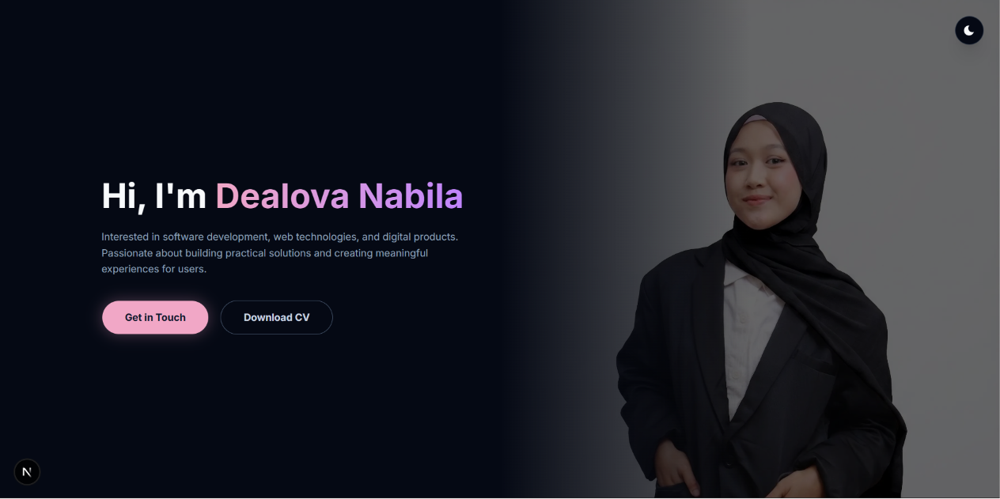
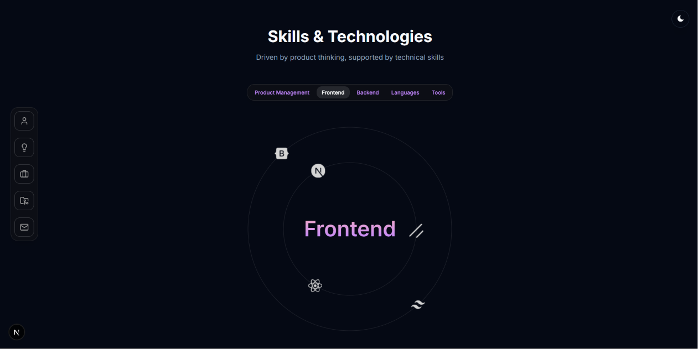

# PersonalSite-v2 ✨

<div align="center">
  
  
</div>

A modern, animated personal portfolio website built with **Next.js 16**, **TypeScript**, and **Tailwind CSS v4**. Designed to showcase projects, experiences, and skills with a premium feel — featuring smooth Framer Motion animations, a dynamic light/dark theme, and a fully functional contact form powered by Resend.


## Features

- **Hero Section** — Full-screen landing with background photo overlay and gradient blending
- **Skills & Technologies** — Tabbed categorization with orbiting icon animations
- **Experience Timeline** — Interactive draggable timeline with smart popup placement and click-outside-to-dismiss behavior
- **Featured Projects** — Card grid with hover effects and detailed modals (supports both PM case studies and FE projects)
- **Contact Form** — Functional email form using Resend (server-side via Next.js Server Actions)
- **Floating Sidebar Navigation** — Appears on scroll with a discovery hint for first-time visitors; hover-activated on desktop, always-visible on mobile
- **Light / Dark Theme** — Seamless toggle with CSS custom properties and `next-themes`
- **Responsive Design** — Fully optimized for mobile, tablet, and desktop screens
- **Smooth Animations** — Page-wide Framer Motion transitions and micro-interactions
- **Centralized Layout System** — Section spacing and container widths managed from a single source in `page.tsx`

## Tech Stack

| Category       | Technology                                    |
| -------------- | --------------------------------------------- |
| Framework      | Next.js 16 (App Router)                       |
| Language       | TypeScript 5                                  |
| Styling        | Tailwind CSS v4, CSS Custom Properties        |
| Animations     | Framer Motion / Motion                        |
| UI Components  | Radix UI, Shadcn UI, Lucide Icons             |
| Email          | Resend (via Server Actions)                   |
| Theme          | next-themes                                   |
| Font           | Inter (Google Fonts)                          |

## Project Structure

```
personalsite-v2/
├── app/
│   ├── actions/          # Server Actions (e.g. sendEmail)
│   ├── projects/         # Dynamic project routes
│   ├── globals.css       # Global styles & CSS theme variables
│   ├── layout.tsx        # Root layout with theme provider
│   └── page.tsx          # Main page — assembles all sections
├── components/
│   ├── layout/           # Footer, Sidebar, ThemeProvider
│   ├── sections/         # Hero, Skills, Experience, Project, Contact
│   └── ui/               # Reusable UI (Button, Tabs, Timeline, Modal, Carousel, etc.)
├── lib/
│   ├── data/             # Static data files (projects, skills, experiences, socials)
│   ├── animations.ts     # Shared Framer Motion animation variants
│   └── utils.ts          # Utility functions (cn, scrollToSection)
├── types/                # TypeScript type definitions
└── public/               # Static assets (images, icons, fonts)
```

## Getting Started

### Prerequisites

- **Node.js** 18 or later
- **npm** (or yarn / pnpm)

### Installation

1. **Clone the repository**

   ```bash
   git clone https://github.com/dvsalmah/personalsite-v2.git
   cd personalsite-v2
   ```

2. **Install dependencies**

   ```bash
   npm install
   ```

3. **Set up environment variables**

   Create a `.env.local` file in the root directory:

   ```env
   RESEND_API_KEY=your_resend_api_key
   ```

   You can get a free API key from [resend.com](https://resend.com).

4. **Run the development server**

   ```bash
   npm run dev
   ```

   Open [http://localhost:3000](http://localhost:3000) in your browser.

### Build for Production

```bash
npm run build
npm start
```

## License

This project is for personal use. Feel free to use it as inspiration for your own portfolio!

---

Built with ❤️ by **Dealova Nabila**
